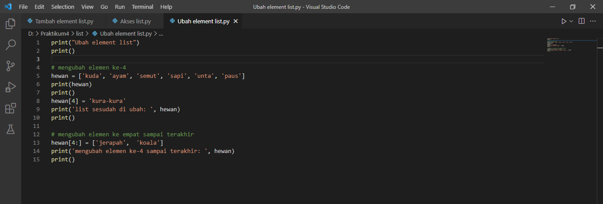
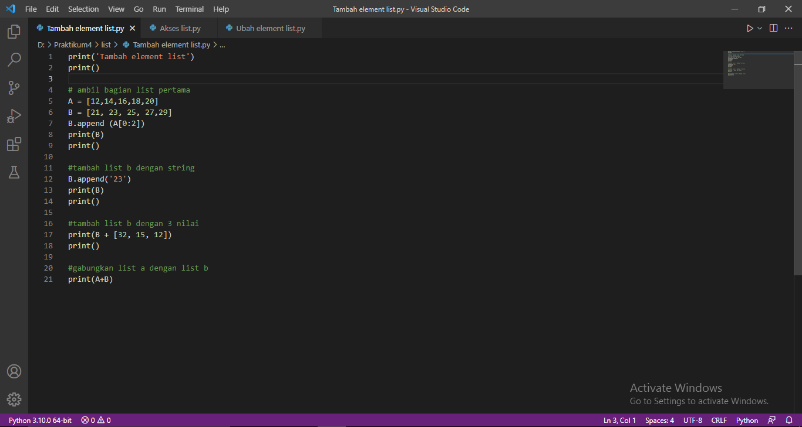
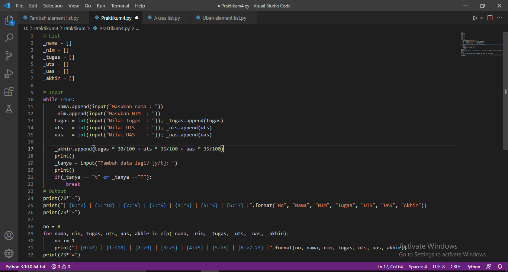

# labspy04

# Latihan 
## Akses List
- Tampilkan elemen ke-3
- Ambil nilai elemen ke-2 sampai elemen ke-4
- Ambil elemen terakhir

### Program


### Penjelasan
1. Buat list dengan nilai yang diinginkan
```python
hewan = ['kuda', 'ayam', 'semut', 'sapi', 'unta', 'paus']
```

2. Menampilkan semua elemen yang terdapat dalam list 
print(hewan)
```

3. Menampilkan salah satu element dalam list kita dapat menggunakan `hewan[3]`
```python
print('Hewan di elemen ke-3 yaitu:', hewan[3])
```

4. Jika ingin mengambil elemen ke-2 sampai elemen ke-4 kita dapat menggunakan `hewan[2:4]`
```python
print(hewan[2:4])
```

5. Jika ingin mengambil elemen terakhir kita dapat menggunakan `hewan[-1]`
```python
print (hewan[-1])
```
### Output


## Ubah Elemen List
- Ubah elemen ke-4 dengan nilai lainnya
- Ubah elemen ke-4 sampai dengan elemen terakhir

### Program


### Penjelasan
1. Buat list dengan nilai yang diinginkan
```python
hewan = ['kuda', 'ayam', 'semut', 'sapi', 'unta', 'paus']
```

2. Menampilkan semua elemen yang terdapat dalam list 
```python
hewan[4] = 'kura-kura'
print("list sesudah di ubah:", hewan)
```

3. Jika ingin mengubah elemen ke-4 sampai elemen terakhir kita dapat menggunakan `hewan[4:]`
```python
hewan[3:] = ['jerapah', 'koala']
print('mengubah elemen ke-4 sampai terakhir :', hewan)
```

### Output


## Menambahkan Elemen List
- Ambil 2 bagian dari list pertama (A) dan jadikan list ke-2 (B)
- Tambah list B dengan nilai string
- Tambah list B dengan 3 nilai
- Gabungkan list B dengan list A

### Program


### Penjelasan
1. Buat list dengan variabel A dan B
```python
A = [12,14,16,18,20]
B = [21,23,25,27,29]
```

2. Ambil 2 bagian dari list A dan tambahkan kedalam list B
```python
B.append(A[0:2])
print(B)
```

3. Menambahkan nilai string kedalam list B
```python
B.append('23')
print(B)
```

4. Untuk menambahkan 3 nilai kedalam list B dengan cara
```python
print(B + [35, 15, 12])
print()
```

5. Menggabungkan list A dengan list B
```python
print(A+B)
```

### Output


# Tugas Praktikum
## Program sederhana untuk menambahkan data kedalam sebuah list 
### Program


### Penjelasan
1. Deklarasi list
```python
_nama = []
_nim = []
_tugas = []
_uts = []
_uas = []
_akhir = []
```

2. Program perulangan menggunakan _while loop_ dengan nilai "True"
```python
while True:
```

3. Input nama, nim, tugas, uts, uas, dan akhir dengan menambahkan method `.append`. Untuk (tugas,uts dan uas) akan dimasukan kedalam variable untuk dijumlahkan dan menghasilkan akhir
```python
    _nama.append(input("Masukan nama : "))
    _nim.append(input("Masukan NIM  : "))
    tugas = int(input("Nilai tugas  : ")); _tugas.append(tugas)
    uts   = int(input("Nilai UTS    : ")); _uts.append(uts)
    uas   = int(input("Nilai UAS    : ")); _uas.append(uas)

    _akhir.append(tugas * 30/100 + uts * 35/100 + uas * 35/100)
```

4. Pada input tanya [y/t] dan apabila jawabannya t atau T , maka program tersebut akan berhenti dan akan menampilkan hasil data yang sudah di input
```python
    _tanya = input("Tambah data lagi? [y/t]: ")
    print()
    if(_tanya == "t" or _tanya =="T"):
        break
```

5. Untuk membuat header table, menggunakan `print(73*"=")`, fungsinya untuk membuat "=" sebanyak 73 sebagai garis, dan menggunakan format string
```python
print(73*"=")
print("| {0:^2} | {1:^18} | {2:^9} | {3:^5} | {4:^5} | {5:^5} | {6:^7} |".format("No", "Nama", "NIM", "Tugas", "UTS", "UAS", "Akhir"))
print(73*"=")
```

6. Deklarasi `no = 0` untuk membuat nomor pada isi table, lalu membuat perulangan dengan `for`
- Perulangan `nama, nim, tugas, uts, uas`, sesuai urutan yang ada di dalam `zip`
- Pada list yang dimaksud, `in zip` berfungsi untuk membungkus semua list
```python
no = 0
for nama, nim, tugas, uts, uas, akhir in zip(_nama, _nim, _tugas, _uts, _uas, _akhir):
```

7. Membuat isi tabel sesuai dengan header table diatas dengan format string
```python
no += 1    
    print("| {0:>2} | {1:<18} | {2:>9} | {3:>5} | {4:>5} | {5:>5} | {6:>7.2f} |".format(no, nama, nim, tugas, uts, uas, akhir))
```

8. Untuk membuat footer atau garis paling bawa ketika looping isi table selesai
```python
print(73*"=")
```

### Output


### Selesai

## Terima Kasi